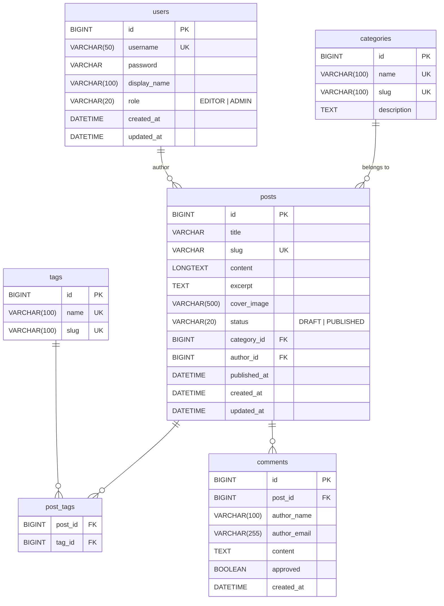
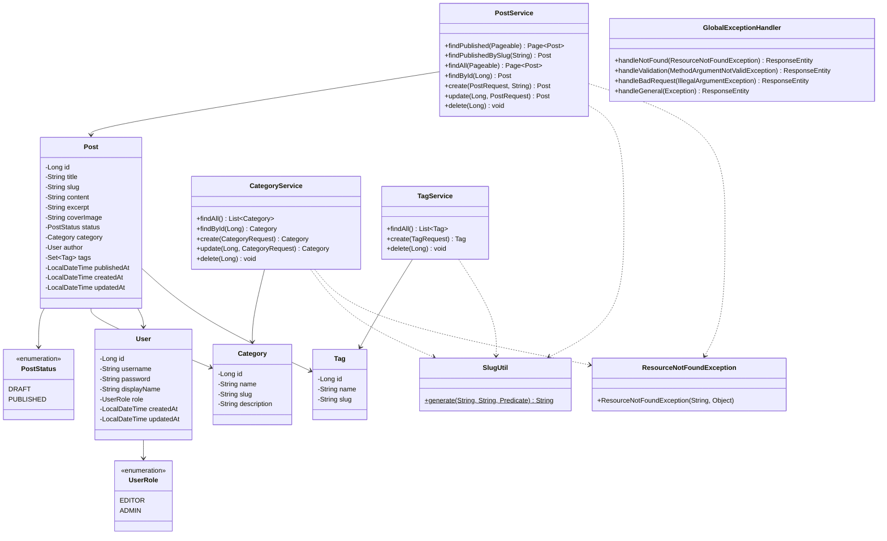

# ER図・クラス図

## ER図 (Entity Relationship Diagram)

## クラス図 (Class Diagram)

## テーブル関係の説明

| 関係 | 説明 |
|---|---|
| `users` → `posts` | 1対多: 1ユーザーが複数記事を作成 |
| `categories` → `posts` | 1対多: 1カテゴリに複数記事 (nullable) |
| `posts` ↔ `tags` | 多対多: 中間テーブル `post_tags` |
| `posts` → `comments` | 1対多: 1記事に複数コメント (将来実装) |
